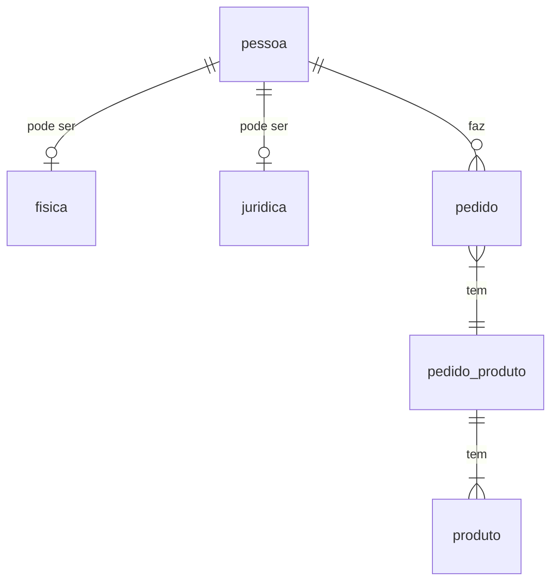

# The orders processor!
>Let's have some pizza!

The purpose of this project is to demonstrate good practices on Java development with Spring Boot, Spring Web and Spring Data JPA.

Very often, some functionalities will be made twice with different approaches.

## Guidelines to development

### RELACIONAL 
*PESSOA*
- ID
- nome
- data nascimento
- *FISICA* 
  - cpf
- *JURIDICA*
  - cnpj

*PEDIDO*
- ID pedido
- Data
- codigo pessoa

*PEDIDO_PRODUTO*
- ID pedido
- ID produto
- quantidade

*PRODUTO*
- ID produto
- descrição produto
- validade produto

- 1 - 1 pessoa fisia ou juridica
- 1 - N pedido pessoa
- 1 - N - 1 pedido, pedido_produto, produto

### DOCUMENTO
json coleção de saidaProduto
{
  "nomePessoa":"",
  "tipoPessoa":"",
  "numeroDocumento":"",
  "nomeProduto":"",
  "qtdProduto":""
}
#### mapstruct
- https://reflectoring.io/java-mapping-with-mapstruct/

### tipos de model
#### annotations
- O Hibernate atualiza o banco de dados ao subir a aplicação sem, no entanto, recriar objetos. Este é o comportamento padrão, mas pode ser desativado caso o banco de dados seja versionado em pipeline própria.
- O versionamento dos objetos de banco de dados fica na própria aplicação.
- Até o commit 
#### migrations
- Podem ser usadas para preencher dados mestres ou para versionar objetos de banco de dados
- https://flywaydb.org/
  - Ferramenta para versionamento de banco de dados na própria aplicação
  - Requer que os scripts de banco de dados estejam na aplicação ou então em um local acessível pela aplicação, como um diretório compartilhado ou storage na nuvem
  - Ao incluir a biblioteca flyway-core (https://mvnrepository.com/artifact/org.flywaydb/flyway-core), o Flyway desativa a execução de DDL pelo Hibernate. Portanto, todo DDL deve ser executado em pipeline própria ou pelo próprio Flyway ao iniciar a aplicação.

### tipos de repository
#### Consulta Nativa
#### Criteria API
#### JPQL (Java Persistence Query Language):
#### HQL (Hibernate Query Language):
#### Projeção
### tratamento de exceções
### logger
### swagger
- para Spring Boot 3.x, usar https://www.baeldung.com/spring-rest-openapi-documentation
- a ideia é usar a biblioteca org.springdoc.springdoc-openapi-starter-webmvc-ui e acessar as URLs do Swagger diretamente:
  - http://localhost:8080/v3/api-docs para description paths
  - http://localhost:8080/swagger-ui/index.html para interface gráfica
### HATEOAS
- https://spring.io/projects/spring-hateoas#samples
  - https://spring.io/guides/gs/rest-hateoas/
  - https://spring.io/guides/tutorials/rest/
### junit - mokito