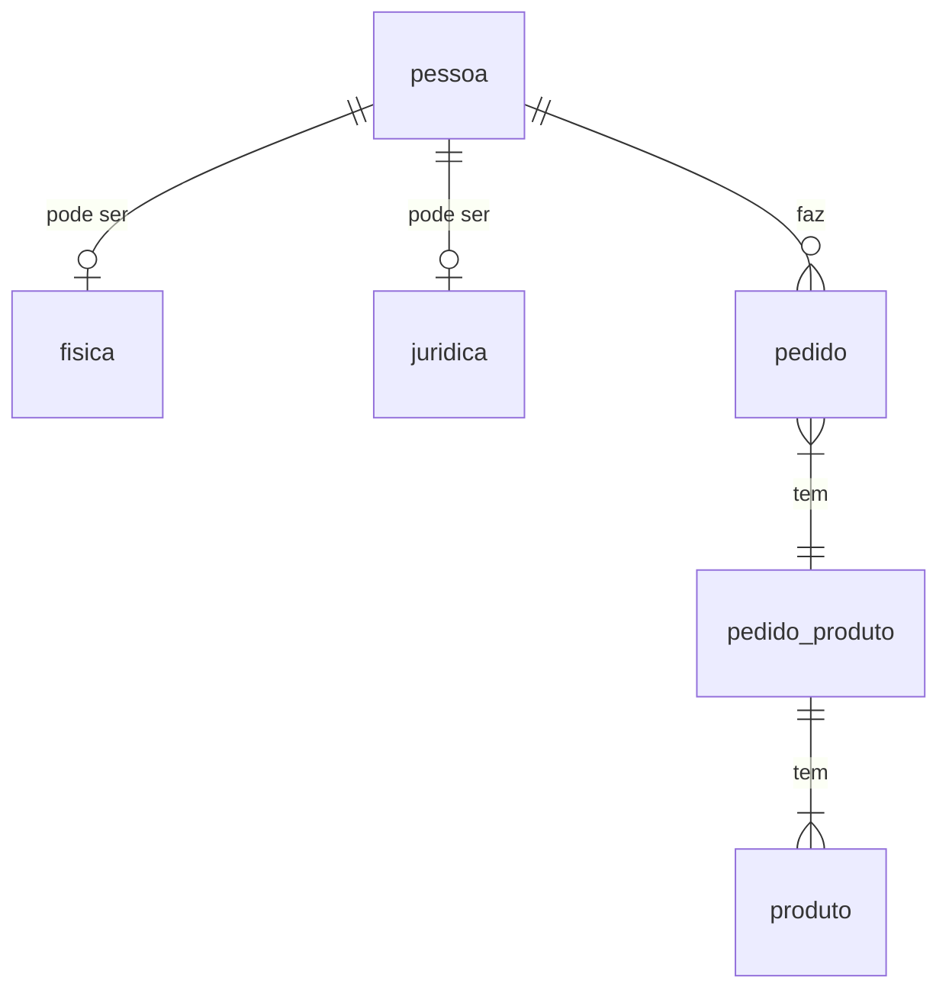

# The orders processor!
>>Let's have some pizza

The purpose of this project is to demonstrate good practices on Java development with Spring Boot, Spring Web and Spring Data JPA.

Very often, some functionalities will be made twice with different approaches.

## Guidelines to development

### RELACIONAL 
*PESSOA*
- ID
- nome
- data nascimento
- *FISICA* 
  - cpf
- *JURIDICA*
  - cnpj

*PEDIDO*
- ID pedido
- Data
- codigo pessoa

*PEDIDO_PRODUTO*
- ID pedido
- ID produto
- quantidade

*PRODUTO*
- ID produto
- descrição produto
- validade produto

- 1 - 1 pessoa fisia ou juridica
- 1 - N pedido pessoa
- 1 - N - 1 pedido, pedido_produto, produto

### DOCUMENTO
json coleção de saidaProduto
{
  "nomePessoa":"",
  "tipoPessoa":"",
  "numeroDocumento":"",
  "nomeProduto":"",
  "qtdProduto":""
}

tipos de model
  annotations ou migrations
tipos de repository
  Consulta Nativa
  Criteria API
  JPQL (Java Persistence Query Language):
  HQL (Hibernate Query Language):
  Projeção
tratamento de exceções
logger
sweggar
junit - mokito